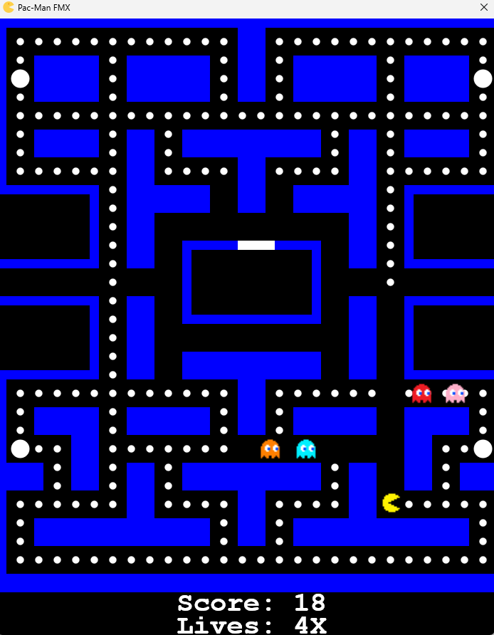

# Pac-Man FMX (Delphi)

Esta é uma implementação do jogo Pac-Man desenvolvida usando o framework FireMonkey (FMX) do Delphi.

  

## Índice

* [Recursos](#recursos)
* [Tecnologias Utilizadas](#tecnologias-utilizadas)
* [Pré-requisitos](#pré-requisitos)
* [Configuração e Instalação](#configuração-e-instalação)
* [Como Jogar](#como-jogar)
* [Controles do Jogo](#controles-do-jogo)
* [Estrutura do Código](#estrutura-do-código)
* [Problemas Conhecidos](#problemas-conhecidos)
* [Melhorias Futuras](#melhorias-futuras)
* [Créditos](#créditos)
* [Contato](#contato)

## Recursos <a name="recursos"></a>

* Recriação fiel da jogabilidade clássica do Pac-Man.
* Animações suaves.
* IA básica dos fantasmas com comportamento de perseguição e fuga.
* Contagem de pontos.
* Sistema de vidas.
* Efeito de túnel (travessia da tela).
* Power pills e modo inofensivo.
* Tela de Game Over.

## Tecnologias Utilizadas <a name="tecnologias-utilizadas"></a>

* **Delphi**: A linguagem de programação principal.
* **FireMonkey (FMX)**: O framework UI cross-platform do Delphi para construir aplicativos que rodam em vários sistemas operacionais (embora este projeto possa ser focado em desktop).
* **Gráficos 2D**: O canvas do FMX para renderizar os elementos do jogo.

## Pré-requisitos <a name="pré-requisitos"></a>

Para compilar e executar este jogo, você precisará de:

* **IDE Delphi**: Embarcadero Delphi (versão Rio ou posterior recomendada).

## Configuração e Instalação <a name="configuração-e-instalação"></a>

1.  Clone o repositório para sua máquina local:

    ```bash
    git clone https://github.com/danilodsf/PacMan_FMX.git
    ```
2.  Abra o arquivo de projeto `PacManFMX.dproj` na IDE do Delphi.
3.  Certifique-se de que todos os arquivos de imagem necessários estejam nos caminhos relativos corretos (geralmente em um diretório `img/` dentro do projeto).
4.  Compile e execute o projeto dentro da IDE do Delphi.

## Como Jogar <a name="como-jogar"></a>

O objetivo do jogo é controlar o Pac-Man e comer todos os pontos no labirinto enquanto evita os fantasmas. Comer uma power pill (os pontos maiores) permitirá que o Pac-Man coma os fantasmas por um curto período de tempo.

## Controles do Jogo <a name="controles-do-jogo"></a>

* **Movimento:**
    * `W` ou `Seta para Cima`: Mover para Cima
    * `A` ou `Seta para a Esquerda`: Mover para a Esquerda
    * `S` ou `Seta para Baixo`: Mover para Baixo
    * `D` ou `Seta para a Direita`: Mover para a Direita
* **Reiniciar o Jogo:**
    * `R`: Reiniciar o jogo
* **Sair:**
    * `ESC`: Sair do jogo

## Estrutura do Código <a name="estrutura-do-código"></a>

O projeto está principalmente contido no arquivo `uGame.pas`. Os principais procedimentos e funções incluem:

* `TPacManForm`: A classe do formulário principal.
* `FormCreate`: Inicializa as variáveis do jogo, carrega as imagens e configura o jogo.
* `FormDestroy`: Libera os recursos alocados (bitmaps, fonte).
* `PaintBoxPaint`: Lida com a lógica de renderização do jogo.
* `TimerTimer`: O evento do timer do jogo, que aciona o `PaintBoxPaint` para atualizar a exibição.
* `MovePlayer`: Processa a entrada do jogador para alterar a direção do Pac-Man.
* `DrawBoard`: Desenha o labirinto, os pontos e as power pills.
* `DrawPlayer`: Desenha e anima o Pac-Man.
* `DrawGhost`: Desenha os fantasmas.
* `GhostAI`: Implementa a lógica de comportamento dos fantasmas.
* `Collider`: Lida com a detecção de colisão com as paredes.
* `TurningCorner`: Gerencia as curvas do Pac-Man nos cantos.
* `PacmanTunnel`: Cria o efeito de túnel.
* `GhostAndPacmanCollision`: Detecta colisões entre o Pac-Man e os fantasmas.

## Problemas Conhecidos <a name="problemas-conhecidos"></a>

* De vez em quando o PacMan fica preso antes das esquinas. Provavelmente o problema está relacionado com a velocidade em FSpeedFactor que faz com que a posição XY as vezes esteja fora das condições que permitem o player virar
* A IA dos fantasmas pode ser aprimorada 

## Melhorias Futuras <a name="melhorias-futuras"></a>

* Implementar efeitos sonoros
* Implementar as outras imagens disponíveis na pasta de imagens
* Implementar a animação do PacMan morrendo ao colidir
* Adicionar diferentes personalidades aos fantasmas
* Melhorar a interface do usuário do jogo, criando opções de configuração de velocidade, pausar, etc...

## Créditos <a name="créditos"></a>

* **Inspiração:** Leonardo Nunes Armelim, que desenvolveu este jogo em Python e os fontes me serviram como base para o desenvolvimento com o Delphi
https://github.com/Leonardo-Nunes-Armelim/Bytes_Universe

## Contatos <a name="contato"></a>

https://www.linkedin.com/in/danilo-fois-27743b142/
